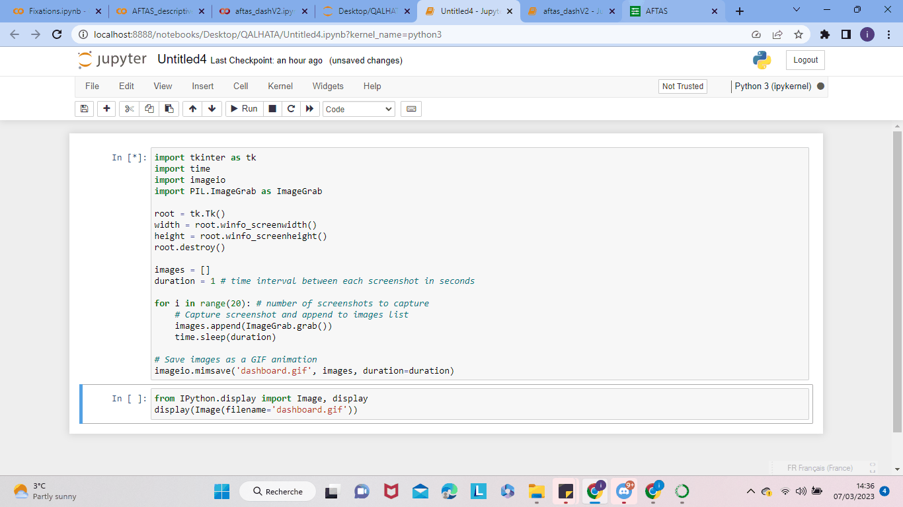

Overview of the AFTAS project during my internship at QALHATA Technologies : Gaze behaviors of a pilot are an essential avenue for gaining insights into the inner workings of the Pilot's operational efficiencies. Given the close relationship between the allocation of attention resources to various information modalities in a cockpit and the resultant efficacy of task performance, building an ML model that can track a pilot's eye fixations in a typical environment (cockpit) is considered a natural progression from models such as the SEEV model.

Analysis of current experimental results of this project, suggests that contextualizing the model building to typical cockpit surfaces(ECAM, EFIS, PFD) - our selected Areas of Interest (AoIs) - yields more accurate model outputs than the case of building models on data of the entire flying cycle. - (REF Paper here) The ultimate objective is to be able to determine the gaze characteristics (which can be indicators of cognitive processing) of a pilot, upon which targeted training programs for mitigating human factors may be enabled. Furthermore, it would be useful for a pilot in training for example, who benefits from being able to compare task performance outputs against more experienced pilots.

For this purpose, the comparisons must be made against appropriate metrics. The following are considered: duration spent on a surface, frequency of entry and exits relative to the surface, the position of fixations inside a surface....etc. All these metrics are analyzed for a typical flying behavior of a pilot carrying out a recommended flying task.

These first iterations of the modeling and associated analytical outputs, aim to demonstrate the feasibility of an Advanced Flight Training Analytics Service (AFTAS) by Qalhata Technologies Ltd - UK Based Science, Engineering, and Technology Startup.

This project is split into 2 parts: the first focus on the descriptive statistics of the collection to demystify any possible relations between the variables, comparing the predictability of two models: ANN and LR. The chosen model will be then used on instructor(Pilot) data and implemented as the base model to analyze other pilots' performances. The second part consists of creating a dashboard, using the vanilla Library, to visualize the performance of a pilot based on his previous attempts at flight simulation, and in a group with other pilots for the same simulation.

Both models( ANN and LR) have similar accuracies in different scenarios(1 predictor or multiple predictors). Two conclusions can be drawn from our analysis :

The case of using one predictor(duration) enables higher accuracies than the other combinations of predictors.
In all the scenarios, the LR outperforms slightly the ANN.
However, the tests of correlation prove that there is no significant relationship between the predictor(duration) and target variable(fixation x [px]). Therefore, the accuracies of LR may not be consistent as it assumes a natural correlation between the predictor and predictand. Hence, the non-linear regression model, ANN, is the best model to choose.

import pandas as pd

